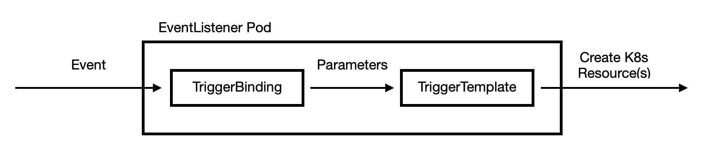

# Tekton Triggers

触发器使用户能够将事件负载中的字段映射到资源模板中。换句话说，这允许事件将自己建模并实例化为Kubernetes资源。 在tektoncd/pipeline案例中，将配置封装到PipelineRuns和PipelineResources中变得很容易。



## 安装

```bash
kubectl apply --filename https://storage.googleapis.com/tekton-releases/triggers/latest/release.yaml

```

查看pod是否已经运行

```bash
kubectl get pods --namespace tekton-pipelines
NAME                                           READY   STATUS    RESTARTS   AGE
tekton-dashboard-5dd4cf8d8b-csz6b              1/1     Running   0          6h11m
tekton-pipelines-controller-6d55778887-7m9zn   1/1     Running   0          6h12m
tekton-pipelines-webhook-69796f78cf-zzlvg      1/1     Running   0          6h12m
tekton-triggers-controller-788d5f47f4-kmdxw    1/1     Running   0          34m
tekton-triggers-webhook-66dbd655d7-qh52p       1/1     Running   0          34m
```

## TriggerTemplate

```yaml
apiVersion: triggers.tekton.dev/v1alpha1
kind: TriggerTemplate
metadata:
  name: pipeline-template
spec:
  params:
  - name: gitrevision
    description: The git revision
    default: master
  - name: gitrepositoryurl
    description: The git repository url
  - name: message
    description: The message to print
    default: This is the default message
  - name: contenttype
    description: The Content-Type of the event
  resourcetemplates:
  - apiVersion: tekton.dev/v1beta1
    kind: PipelineRun
    metadata:
      generateName: simple-pipeline-run-
    spec:
      pipelineRef:
        name: simple-pipeline
      params:
      - name: message
        value: $(params.message)
      - name: contenttype
        value: $(params.contenttype)
      resources:
      - name: git-source
        resourceSpec:
          type: git
          params:
          - name: revision
            value: $(params.gitrevision)
          - name: url
            value: $(params.gitrepositoryurl)
```

## TriggerBindings

TriggerBindings 通过绑定事件与触发器，从而从事件捕获字段并存储为参数。 分离bindings和template是便于复用他们。

```yaml
apiVersion: triggers.tekton.dev/v1alpha1
kind: TriggerBinding
metadata:
  name: pipeline-binding
spec:
  params:
  - name: gitrevision
    value: $(body.head_commit.id)
  - name: gitrepositoryurl
    value: $(body.repository.url)
  - name: contenttype
    value: $(header.Content-Type)
```

TriggerBindings连接到EventListener中的TriggerTemplates，这是pod实际实例化的地方，它“侦听”各个事件

TriggerBindings 可以提供传递给triigerTemplate的参数，每一个参数都有一个name和一个value

### 事件变量插值

triggerbindings 可以使用$(jsonPath表达式)访问http json body 和headers的值。对于header的key是大小写不敏感的。 

```bash
$(body.key1)
$(.body.key)
```

一个$()可以包含另一个$(),最里面的$()的内容将作为外面的$()的jsonPath表达式

```bash
$($(body.b)) => $(body.b)
$($($(body.b))) -> $(body.b)
```

使用转义符\可以使json key包含‘.’。

```bash
# body contains a filed called "tekton.dev" e.g. {"body": {"tekton.dev": "triggers"}}
$(body.tekton\.dev) -> "triggers"
```

一些例子

```bash

`$(body)` is replaced by the entire body.

$(body) -> "{"key1": "value1", "key2": {"key3": "value3"}, "key4": ["value4", "value5", "value6"]}"

$(body.key1) -> "value1"

$(body.key2) -> "{"key3": "value3"}"

$(body.key2.key3) -> "value3"

$(body.key4[0]) -> "value4"

$(body.key4[0:2]) -> "{"value4", "value5"}"

# $(header) is replaced by all of the headers from the event.

$(header) -> "{"One":["one"], "Two":["one","two","three"]}"

$(header.One) -> "one"

$(header.one) -> "one"

$(header.Two) -> "one two three"

$(header.Two[1]) -> "two"
```

### Multiple Bindings

在EventListener中，可以指定多个绑定作为触发器的一部分。这允许您创建可与各种触发器混合和匹配的可重用绑定。例如，具有一个提取事件信息的绑定和另一个提供部署环境信息的绑定的触发器：

```yaml
apiVersion: triggers.tekton.dev/v1alpha1
kind: TriggerBinding
metadata:
  name: event-binding
spec:
  params:
    - name: gitrevision
      value: $(body.head_commit.id)
    - name: gitrepositoryurl
      value: $(body.repository.url)
---
apiVersion: triggers.tekton.dev/v1alpha1
kind: TriggerBinding
metadata:
  name: prod-env
spec:
  params:
    - name: environment
      value: prod
---
apiVersion: triggers.tekton.dev/v1alpha1
kind: TriggerBinding
metadata:
  name: staging-env
spec:
  params:
    - name: environment
      value: staging
---
apiVersion: triggers.tekton.dev/v1alpha1
kind: EventListener
metadata:
  name: listener
spec:
  triggers:
    - name: prod-trigger
      bindings:
        - name: event-binding
        - name: prod-env
      template:
        name: pipeline-template
    - name: staging-trigger
      bindings:
        - name: event-binding
        - name: staging-env
      template:
        name: pipeline-template
```

##  EventListener

EventListener是一个Kubernetes自定义资源，它允许用户以声明的方式使用JSON有效负载处理传入的基于HTTP的事件。EventListeners公开一个可寻址的“接收器”，传入的事件被定向到该接收器。用户可以声明TriggerBindings以从事件中提取字段，并将其应用于TriggerTemplates以创建Tekton资源。此外，事件侦听器允许使用事件侦听器进行轻量级事件处理.

### Multi-Tenant Concerns

EventListener实际上是Tekton的另一种客户机形式，而不是您在别处看到的通过kubectl或tkn使用的示例。特别是，基于HTTP的事件绕过了通过kubeconfig文件和kubectl config系列命令获得的普通Kubernetes身份验证路径。


因此，决定是否使用前需要考虑下列事项

- 最好将集群中的（每个）EventListener公开给外部世界。

- 最佳控制EventListener和下面描述的底层API对象如何访问、创建和更新集群中与Tekton相关的API对象。

至少，每个EventListener都有其ServiceAccountName，如下所述，所有通过“接收器”的事件都会导致使用分配给该ServiceAccount的权限进行任何Tekton资源交互。


但是，如果您需要对不同触发器和侦听器上的一组Tekton资源具有不同级别的权限，而不是所有触发器或侦听器都可以以相同的方式操作某些Tekton资源，那么一个简单的单个EventListener将不够。

### Multiple EventListeners 
- 每个namespace一个listener
    您可以创建多个EventListener对象，其中您的触发器和拦截器集分布在EventListeners中。

    如果您在这些事件侦听器各自的命名空间中创建它们，那么很容易将不同的权限分配给每个事件侦听器的ServiceAccount以满足您的需要。而且，命名空间的创建常常与一组默认的ServiceAccounts和Secrets耦合在一起，这些ServiceAccounts和Secrets也被定义。因此，可以想象的是，政府采取了一些措施。您只需更新自动创建的服务帐户的权限。

    可能的缺点：-总的来说，具有相关机密和服务帐户的名称空间被证明是基础etcd存储库Kubernetes中最昂贵的项。在更大的集群中，etcd存储容量可能会成为一个问题。-多个EventListeners意味着多个HTTP端口必须公开给访问“Sink”的外部实体。如果您碰巧在集群和外部实体之间有一个HTTP防火墙，这意味着要付出更多的管理成本，为每个服务打开防火墙中的端口，除非您可以使用Kubernetes入口作为一组事件侦听器的路由抽象层。

 - 每个namespace多个listener
    对于管理员来说，每个命名空间有多个EventListener很可能意味着更多的ServiceAccount/Secret/RBAC操作，因为作为命名空间创建一部分的那些工件的一些内置生成不适用。

    但是，通过减少名称空间的数量，可以节省一些etcd存储成本。

    多个事件侦听器和潜在的防火墙问题仍然适用（同样，除非使用入口）。

### EventListenerTrigger的ServiceAccount

通过在EventListenerTrigger上设置ServiceAccount实现更细粒度的权限控制。
您仍然需要创建额外的ServiceAccount。
但是保持在1个名称空间内，并将EventListeners及其相关“Sinks”的数量最小化，可以最大限度地减少对etcd存储和在不使用Ingress情况下的防火墙的端口关注。

### 语法

为一个EventListener定义一个配置文件，需要定义以下字段：

- 依赖项

    - apiVersion 指定api版本，例如 triggers.tekton.dev/v1alpha1
    - kind  指定 EventListener 资源对象.
    - metadata 指定唯一标识EventListener资源对象的数据，例如name.
    - spec  指定EventListener资源对象的配置信息。为了让EventListener执行一些操作，规范必须包括：
        - triggers 指定要运行的Triggers的列表
        - serviceAccountName - 指定EventListener用于创建资源的ServiceAccount
- 可选项
    - serviceType 指定接收器pod公开的服务类型

#### ServiceAccountName

ServiceAccountName 是依赖项。EventListener的sink用于创建Tekton资源的ServiceAccount。ServiceAccount需要具有以下规则的角色

```yaml
kind: Role
apiVersion: rbac.authorization.k8s.io/v1
metadata:
  name: tekton-triggers-example-minimal
rules:
# Permissions for every EventListener deployment to function
- apiGroups: ["triggers.tekton.dev"]
  resources: ["eventlisteners", "triggerbindings", "triggertemplates"]
  verbs: ["get"]
- apiGroups: [""]
  # secrets are only needed for Github/Gitlab interceptors, serviceaccounts only for per trigger authorization
  resources: ["configmaps", "secrets", "serviceaccounts"]
  verbs: ["get", "list", "watch"]
# Permissions to create resources in associated TriggerTemplates
- apiGroups: ["tekton.dev"]
  resources: ["pipelineruns", "pipelineresources", "taskruns"]
  verbs: ["create"]
```

如果EventListener使用ClusterTriggerBindings,需要使用含有ClusterRole的ServiceAccount.

#### Triggers

triggers是依赖项。每个EventListenerll可以包含一个或者多个triggers。一个trigger包括：

- name - (可选) 一个有效的kubernetes name
- interceptors - (可选)) 要使用的interceptors 列表
- bindings - 需要使用或嵌入到TriggerBindingsSpecs使用的TriggerBindings引用列表
- template - TriggerTemplate的名称

```yaml
triggers:
  - name: trigger-1
    interceptors:
      - github:
          eventTypes: ["pull_request"]
    bindings:
      - name: pipeline-binding
        ref:  pipeline-binding
      - name: message-binding
        spec:
            params:
              - name: message
                value: Hello from the Triggers EventListener!
    template:
      name: pipeline-template
```
此外，为了支持多租户样式的场景，其中管理员可能不希望所有触发器都具有与EventListener相同的权限，可以选择在触发器级别设置ServiceAccount，并在创建资源时使用ServiceAccount（如果存在）来代替EventListener的ServiceAccount：

```yaml
triggers:
  - name: trigger-1
    serviceAccount:
      name: trigger-1-sa
      namespace: event-listener-namespace
    interceptors:
      - github:
          eventTypes: ["pull_request"]
    bindings:
      - name: pipeline-binding
        ref:  pipeline-binding
      - name: message-binding
        ref:  message-binding
    template:
      name: pipeline-template
```

EventListener的默认ClusterRole允许从任何命名空间读取ServiceAccounts

#### ServiceType
ServiceType字段是可选项。EventListener sinks通过kubernetes的Service来expose。默认情况下，serviceType是ClusterIP，这意味着运行在同一Kubernetes集群中的任何pod都可以通过其集群DNS访问服务。其他有效值是NodePort和LoadBalancer。

对于要连接到集群的外部服务（例如GitHub发送webhook），请查看有关公开EventListeners的指南。

### Logging

```bash
kubectl get pods --selector eventlistener=my-eventlistener
```
### Lables

默认情况下，EventListeners将自动将以下标签附加到它创建的所有资源

Name|Description
--|--
triggers.tekton.dev/eventlistener|生成资源的EventListener的名称
triggers.tekton.dev/trigger|生成资源的Trigger 的名称
triggers.tekton.dev/eventid|传入事件的uid

### Interceptors

EventListener中的触发器可以选择性地指定Interceptors，以修改触发器的行为或负载。

事件Interceptors目前可以有几种不同的形式：

- Webhook Interceptors
- GitHub Interceptors
- GitLab Interceptors
- CEL Interceptors

#### Webhook Interceptors

